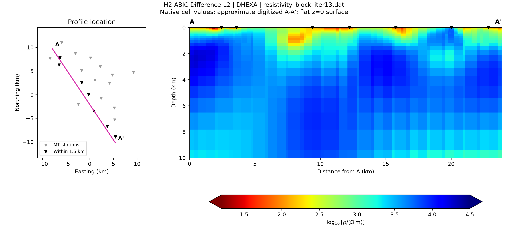

# Broken Hill ABIC

Six FEMTIC-DABIC examples with native inputs, controls, reference convergence histories, an [illustrated report](BrokenHill_ABIC.pdf), and an A-A' plotting script.

## Cases

| Case | Folder under `inputs/` | Control file |
| --- | --- | --- |
| H0, uniform DHEXA, Difference-L2 | `H0_uniform_DHEXA` | `control_ABIC_L2.dat` |
| H1, locally refined DHEXA, Difference-L2 | `H1_locally_refined_DHEXA` | `control_ABIC_L2.dat` |
| H2, nested refined DHEXA, Difference-L2 | `H2_nested_refined_DHEXA` | `control_ABIC_L2.dat` |
| T0, tetrahedral, Difference-L2 | `T0_tetrahedral` | `control_ABIC_L2.dat` |
| H2, Difference-L1 | `H2_nested_refined_DHEXA` | `control_ABIC_L1.dat` |
| H2, Difference-L2 with distortion | `H2_nested_refined_DHEXA` | `control_ABIC_L2_distortion.dat` |

Each folder contains `mesh.dat`, `observe.dat`, and `resistivity_block_iter0.dat`. All cases start from uniform 250 ohm m except distortion, which restarts from H2-L2 iteration 13 with zero initial distortion and weight 10. Its initialization files are in `H2_nested_refined_DHEXA/restart_iter13/`.

## Data and citation

Observations were converted from the published `BH_31.dat`: 21 stations, 24 periods, four impedance and two vertical magnetic transfer-function components. Source: [Zenodo 10.5281/zenodo.21091924](https://doi.org/10.5281/zenodo.21091924), CC BY 4.0. Cite:

- AlQahtani et al. (2026). *Why Does the Broken Hill Deposit Sit in Resistive Crust? Magnetotelluric Evidence for Metamorphic Decoupling of a World-Class Mineral System.* JGR: Solid Earth. [doi:10.1029/2026JB035666](https://doi.org/10.1029/2026JB035666).
- Song et al. (2026). *Three-dimensional Magnetotelluric Inversion based on a Data Space variant of Akaike's Bayesian Information Criterion.* Geophysics. [doi:10.1190/geo-2025-0233](https://doi.org/10.1190/geo-2025-0233).

For upstream FEMTIC citations and build instructions, see the [repository README](https://github.com/hsong-28/FEMTIC-DABIC#readme). These examples do not exactly reproduce the published ModEM inversion workflow.

## Run

Example: H2-L2, using Bash on Linux or WSL. Replace the paths first.

```bash
set -eu
repo_root=/path/to/FEMTIC-DABIC
run_dir=/path/to/new/brokenhill_h2_l2
input_dir="$repo_root/examples/BrokenHill/inputs/H2_nested_refined_DHEXA"

mkdir "$run_dir"  # Parent must exist; run directory must be new.
cp "$input_dir/mesh.dat" "$input_dir/observe.dat" "$run_dir/"
cp "$input_dir/resistivity_block_iter0.dat" "$run_dir/"
cp "$input_dir/control_ABIC_L2.dat" "$run_dir/control.dat"
cd "$run_dir"
export OMP_NUM_THREADS=9
export MKL_NUM_THREADS=9
mpirun -np 6 "$repo_root/src/femtic-dabic"
```

Use the table to select other cases. For distortion, use `control_ABIC_L2_distortion.dat` and copy **both files** from `restart_iter13/` instead of the uniform starting model. Use separate run directories and keep `NUM_THREADS`, environment settings, and allocated resources consistent.

The supplied inputs avoid repeating data conversion and mesh generation. H0/H1/H2 used `makeDHexaMesh`; T0 used a tetrahedral mesh workflow. Rebuilding inputs from the original archive is not included here.

## Plot A-A'

Use Python 3.12, NumPy, and Matplotlib. T0 additionally needs PyVista/VTK; locally checked versions were 0.44.2/9.3.1.

```bash
python -m pip install numpy matplotlib
# For T0 only:
python -m pip install pyvista==0.44.2 vtk==9.3.1

python "$repo_root/examples/BrokenHill/plot_aa_profile.py" \
  --mesh "$run_dir/mesh.dat" \
  --model "$run_dir/resistivity_block_iter13.dat" \
  --label "H2 ABIC Difference-L2" \
  --output "$run_dir/figures/H2_iter13_AA"
```

Select the required iteration. Outputs are PNG, PDF, and JSON provenance; existing files are not overwritten. Defaults are 0-10 km depth and 1.2-4.5 log10 resistivity, adjustable with `--depth-max-km` and `--color-limits MIN MAX`.

The figure shows the profile location and stations projected from within 1.5 km. Keep `profile_AA.json` beside the script: its approximate endpoints were digitized from Figure 5 of AlQahtani et al. (2026) and registered to the released stations. Use the same local origin and X=northing, Y=easting, Z=depth-positive-down convention. The script assumes air block 0, a flat z=0 surface, and axis-aligned DHEXA cells. Native cell values are preserved without spatial interpolation.



*Example output: H2 ABIC Difference-L2, iteration 13.*

## Reference and validation

Run `sha256sum -c SHA256SUMS.txt` from this directory. `reference/summary.csv` gives selected iterations, RMS, status, model hashes, and histories in `reference/convergence/`. RMS retains the histories' printed precision. H1 stopped at the maximum retrial count; distortion iterations are counted from the restart.

Reference inversions used v2.7.0, commit `a52ad40240495be5d7e28fd800f89f1e4465585d`. Packaging checks covered input hashes, mesh/model dimensions, and controls. A-A' slicing was checked against the maintained workflow for H0/H1/H2/T0. No fresh inversion or clean-environment installation was run. Raw ABIC values are not comparable across different mesh parameterizations.
